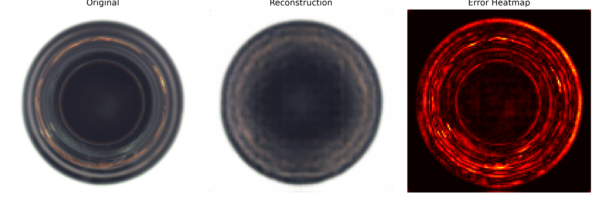
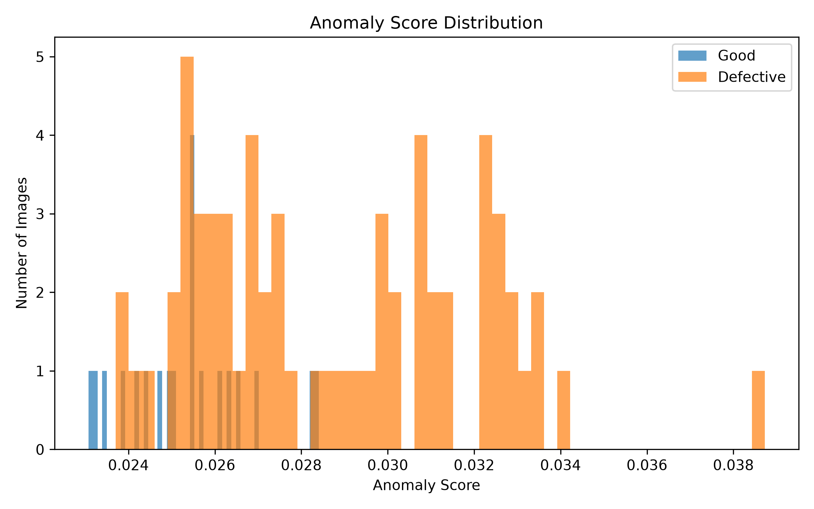

# Industrial Anomaly Detection using Convolutional Autoencoder

A PyTorch implementation of an unsupervised anomaly detection system for industrial inspection using the MVTec AD dataset.

The model is trained **only on normal images** and detects anomalies based on image reconstruction error.

---

# Problem

In industrial inspection, collecting defective samples is expensive and often impractical. Instead of learning every possible defect, the model learns the appearance of **normal products**.

During inference:

* Normal images should be reconstructed accurately.
* Defective images should produce larger reconstruction errors.

The reconstruction error is then used as the anomaly score.

---

# Dataset

* Dataset: MVTec AD
* Category: Bottle
* Training Images: Normal samples only
* Test Images:

  * Good
  * Broken Large
  * Broken Small
  * Contamination

Image Size:

```
128 × 128 × 3
```

---

# Model Architecture

```
Input (3×128×128)

↓

Encoder

Conv(3→32)
MaxPool

↓

Conv(32→64)
MaxPool

↓

Conv(64→128)
MaxPool

↓

Conv(128→256)
MaxPool

↓

Latent Space
256×8×8

↓

Decoder

ConvTranspose(256→128)

↓

ConvTranspose(128→64)

↓

ConvTranspose(64→32)

↓

ConvTranspose(32→3)

↓

Sigmoid

↓

Reconstructed Image
```

---

# Training Configuration

| Parameter  |                    Value |
| ---------- | -----------------------: |
| Framework  |                  PyTorch |
| Optimizer  |                     Adam |
| Loss       | Mean Squared Error (MSE) |
| Image Size |                  128×128 |
| Batch Size |                       16 |

---

# Baseline Results

## Reconstruction & ## Error Heatmap


Original image vs reconstructed image.


---


---

## Anomaly Score Distribution

Histogram of reconstruction errors for normal and defective samples.



---

## Sample Scores

| Category        | Label     |   Score |
| --------------- | --------- | ------: |
| Best Good       | Good      | 0.02307 |
| Best Good       | Good      | 0.02328 |
| Best Good       | Good      | 0.02349 |
| Worst Defective | Defective | 0.03873 |
| Worst Defective | Defective | 0.03409 |
| Worst Defective | Defective | 0.03360 |
| Borderline      | Good      | 0.02698 |
| Borderline      | Defective | 0.02690 |

---

# Baseline Analysis

The baseline Autoencoder successfully reconstructs normal images and assigns higher anomaly scores to many defective samples.

However, the score distributions overlap around the decision boundary.

For example:

* Good sample: **0.02698**
* Defective sample: **0.02690**

The difference is extremely small, making threshold-based classification unreliable.

Although the model learns useful visual representations, reconstruction error alone is not sufficient for robust industrial anomaly detection.

---

# Limitations

* Blurry image reconstruction
* Overlapping anomaly score distributions
* Limited separation between normal and defective samples
* Threshold sensitivity

---

# Future Improvements (Version 2)

The next version will improve the latent representation and anomaly detection capability by introducing architectural enhancements such as:

* Batch Normalization
* Skip Connections
* Improved Bottleneck Design
* Better Feature Representation
* Improved Evaluation Metrics

The objective is to increase the separation between normal and defective anomaly scores while preserving reconstruction quality.

---

# Project Structure

```
industrial-autoencoder/

├── data/
├── models/
├── engine/
├── experiments/
├── outputs/
│   ├── checkpoints/
│   └── baseline/
├── utils/
└── README.md
```

# Version 2 — Convolutional Autoencoder with Batch Normalization

Version 2 improves the baseline autoencoder architecture by introducing a deeper convolutional encoder/decoder and Batch Normalization inside the convolutional blocks.

The goal of this version was to determine whether a more expressive convolutional architecture could learn better image representations and improve reconstruction-based anomaly detection.

---

## Architecture

The model uses four convolutional blocks in the encoder:

```text
Input
3 × 128 × 128
      │
      ▼
ConvBlock
3 → 32
      │
   MaxPool
      ▼
32 × 64 × 64
      │
      ▼
ConvBlock
32 → 64
      │
   MaxPool
      ▼
64 × 32 × 32
      │
      ▼
ConvBlock
64 → 128
      │
   MaxPool
      ▼
128 × 16 × 16
      │
      ▼
ConvBlock
128 → 256
      │
   MaxPool
      ▼
256 × 8 × 8
      │
      ▼
   Bottleneck
```

The decoder reverses this process using transposed convolutions:

```text
256 × 8 × 8
      │
      ▼
128 × 16 × 16
      │
      ▼
64 × 32 × 32
      │
      ▼
32 × 64 × 64
      │
      ▼
3 × 128 × 128
```

Each convolutional block contains:

```text
Conv2d
   ↓
BatchNorm2d
   ↓
ReLU
```

---

## Training Configuration

| Parameter          |               Value |
| ------------------ | ------------------: |
| Dataset            |            MVTec AD |
| Category           |              Bottle |
| Input Size         |           128 × 128 |
| Batch Size         |                  16 |
| Epochs             |                  50 |
| Optimizer          |                Adam |
| Learning Rate      |                1e-3 |
| Loss               | Reconstruction Loss |
| Device             |                CUDA |
| DataLoader Workers |                   2 |

---

## Training Result

The model achieved a significantly lower reconstruction loss compared with the baseline.

| Version   | Final Training Loss |
| --------- | ------------------: |
| Baseline  |           ~0.000600 |
| Version 2 |        **0.000096** |

This represents approximately a **6.25× reduction in training reconstruction loss**.

### Interpretation

The new architecture is substantially better at reconstructing the training images.

However, reconstruction quality alone is not the objective of the anomaly detection system.

The important question is whether reconstruction error can separate normal and defective samples.

---

## Anomaly Detection Results

The trained model was evaluated on the MVTec AD test set.

```text
Number of test samples: 83
```

Version 2 produced reconstruction-error scores approximately in the following range:

```text
0.00739 → 0.00910
```

The scores are considerably more concentrated than those observed in the baseline.

### Threshold Analysis

| Metric         |   Baseline |    Version 2 |
| -------------- | ---------: | -----------: |
| Best Threshold |   0.019187 | **0.007390** |
| Accuracy       | **86.75%** |   **74.70%** |

Version 2 therefore performs worse than the baseline for the current anomaly-detection objective.

---

## Results Visualization

### Reconstruction Error Distribution


### Threshold Analysis


### Example Scores

The following table contains representative samples from the score distribution.

| Category        | Image ID | Label     | Score |
| --------------- | -------: | --------- | ----: |
| Best Good       |        64 | Good      |     0.007631688844412565|
| Best Good       |        74 | Good      |    0.007665157318115234 |
| Worst Defective |       79 | Defective |    0.009100861847400665 |
| Worst Defective |        2 | Defective |     0.008631213568150997 |
| Borderline      |       30 | Defective |     0.007807375397533178 |
| Borderline      |        18 | Good      |    0.00781257450580597 |

---


## What We Learned

Version 2 produced an important experimental result:

> **Lower reconstruction loss does not necessarily lead to better anomaly detection.**

The model became much better at reconstructing the input images:

```text
Reconstruction Loss
        ↓
0.000600 → 0.000096
```

But the separation between normal and defective samples did not improve:

```text
Accuracy
        ↓
86.75% → 74.70%
```

The reconstruction errors became highly concentrated, causing greater overlap between normal and defective samples.

This suggests that increasing model capacity and improving reconstruction quality alone is not sufficient for reconstruction-based anomaly detection.

---

## Conclusion

Version 2 successfully improves the reconstruction capability of the autoencoder, but it fails to improve the actual anomaly-detection objective.

The experiment demonstrates that:

* A lower reconstruction loss is not sufficient.
* A more expressive autoencoder can reconstruct anomalous samples too well.
* The distribution of reconstruction errors is more important than the absolute loss value.
* The anomaly-detection objective needs to be considered when designing the representation and bottleneck.

Therefore, Version 2 is **not an improvement over the baseline for anomaly detection**, despite its substantially lower reconstruction loss.

This result motivates the next version of the model, where the focus will shift from simply improving reconstruction quality toward improving the **separation between normal and anomalous samples**.
